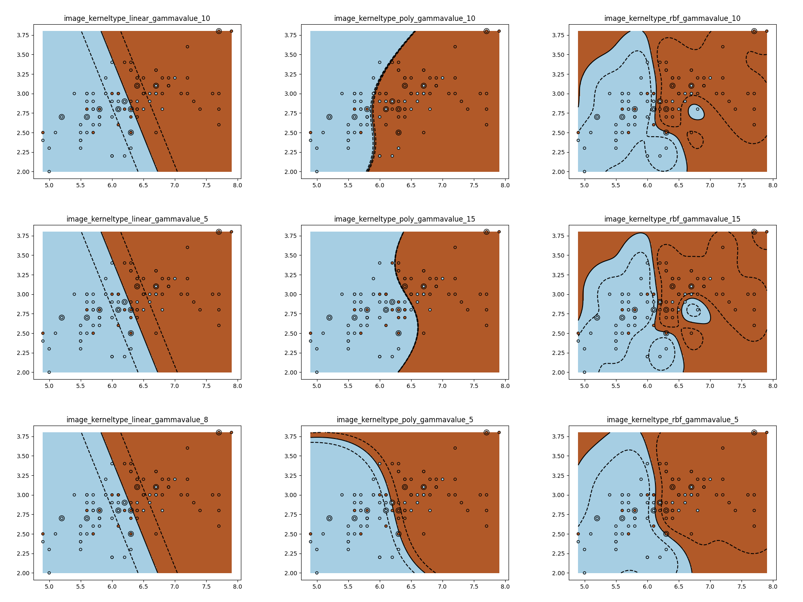

# iexec-SupportVectorMachine-BagOfTasks

This demo is a parameters study for a machine learning application, using the iExec Bag of Tasks feature (distributed computing feature)

Support-vector machines (SVMs) are supervised learning models with associated learning algorithms that analyze data used for classification and regression analysis.

An SVM model is a representation of the examples as points in space, mapped so that the examples of the separate categories are divided by a clear gap that is as wide as possible.

In this example, we want to compare different model (linear, polynomial) and different parameters and select the the more fitted model.

The batch parameters are described in the parameters.csv file.
This file is the input file of the computation

Each line contains a type of model (kernel) and parameters (gamma) for one study.

``` Parameters.csv
linear;5
linear;8
linear;10
linear;15
rbf;5
rbf;10
rbf;15
poly;5
poly;10
poly;15

```
## Expected Results:




The iExec Bags of task feature allows to distribute computation on many computers, just publishing a request order that selects the dApp and describes the set of parameters for each tasks.

With the bag of tasks feature, the worker will use the internal ID of the tasks to get the correct parameters for its simulation.

Ex:
For a task with $IEXEC_BOT_TASK_SIZE = 10 and $IEXEC_BOT_TASK_INDEX = 3

The current worker will read the 3-1 line of the input file and compute the svm with a linear kernel and gamma=8

By default, if the bags of tasks is not activated
the worker will compute all the batchs in the same task.


## Test

Test both mode with single_test.sh and bot_test.sh

## RUN

apprun.sh
